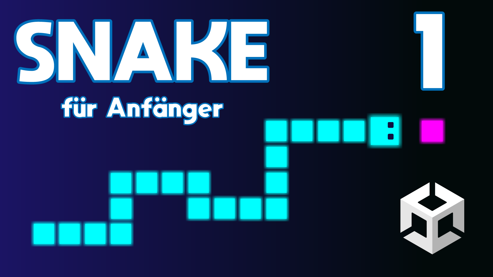

# Snake (2D)

Lerne den Arcade-Klassiker Snake in Unity zu entwickeln. In diesem Spiel steuert der Spieler eine Linie, die über den Verlauf des Spiels länger wird. Das Spiel ist verloren, wenn die Linie eine Wand oder sich selbst berührt. 

- Schwierigkeitsgrad: Anfänger
- Themen: Kollisionen/Trigger, Schleifen, Listen
- Version: 2021.3.14f1
- [🧰 Assets Download](https://github.com/PrezipGames/Snake/blob/main/Snake.unitypackage)
- [🎮 Downloade das ganze Projekt](https://github.com/PrezipGames/Snake/archive/refs/heads/main.zip)
- [🎬 YT Tutorial](https://youtu.be/TvmIRfuLT_Y)
- [💬 Joint unserem Discord Server](https://discord.gg/kusy4JQ4)
- [👍 Abonniert um keine Videos zu verpassen](https://www.youtube.com/@prezipgames)

## Viel Spaß beim Entwickeln!
